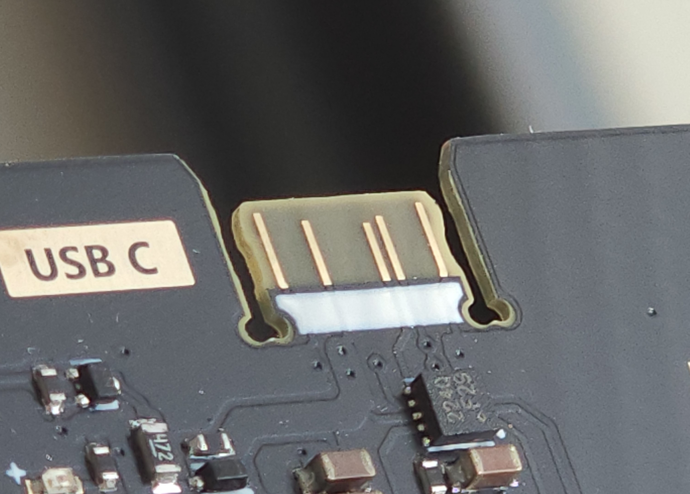

# PCB Edge USB C Connector Library
Use your PCB itself as a USB C connector! This repo includes a KiCAD and EasyEDA library containing 10 and 14 Pin versions.

     

### KiCAD
To use this library in kicad, download the zip file, open the Plugin and Content Manager (PCM), click "Install from file" and choose the zip file.

### EasyEDA
To use this library in EasyEDA pro, import the .elibz files, or search the common library for "PCBTypeC_10P" or "PCBTypeC_14P" to add the symbol to your schematic.

### Other
Some other EDA tools like Altium support importing KiCAD footprints, and EasyEDA supports export to Altium and PADS. Double check against the same footprint in KiCAD or EasyEDA after import.
